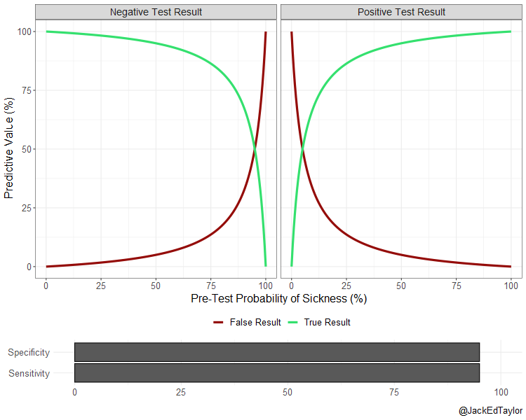

# NEJM-Covid
This project is based on a publication in the NEJM (2020). [False negative tests for SARS-Co-2 Infection – Challenges and Implications](https://www.nejm.org/doi/full/10.1056/NEJMp2015897).
Steven Woloshin, M.D., Neeraj Patel, B.A., and Aaron S. Kesselheim, M.D., J.D., M.P.H. NEJM 383:6 august 6, 2020.
We reproduced all plots in the paper by using the data provided using R, a language and environment for statistical computing and graphics.

#### Conclusion
In the final part of the paper the authors draw several conclusions with regards to the safety of the test, the obligations of manufacturers to provide details of the test in terms of clinical sensitivity and specificity, the problems with false negative results in the general population where pretest probability of disease is much lower than in the hospital environment and they stress the importance of defining thresholds for ruling out infection for a variety of clinical situations.

However, they do not discuss the problems that arise with false positive test results in the general population. In this R project, we tried to complete the picture of reality based on the data provided.

The animation below presents the relationship between a test's sensitivity and specificity on the predictive values of positive and negative test results:

The shiny app in `app.R` presents an interactive graph which lets you explore this relationship in more detail.

#### Running the Shiny App

The Shiny app is hosted online at: http://shiny.ieis.tue.nl/mechelen/

You can run the app locally by downloading the repository and running `app.R`.
